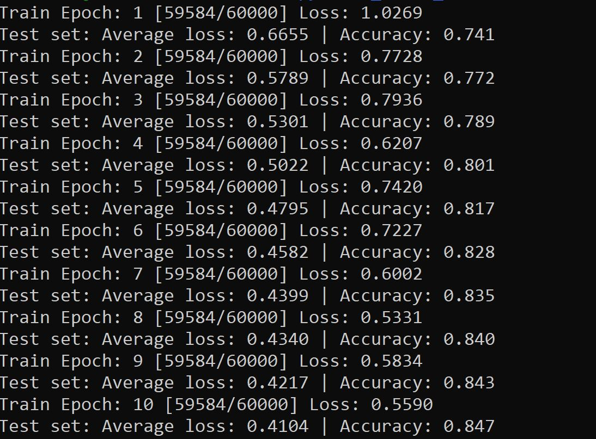

# pytroch_basic_model
The project includes the VGG16 implementation of PyTorch in C++

https://www.westernsydney.edu.au/icns/resources/reproducible_research3/publication_support_materials2/emnist

*The following images how pytorch will be run in C++:*

After the running above code, the achieved weight would be saved in build directory.